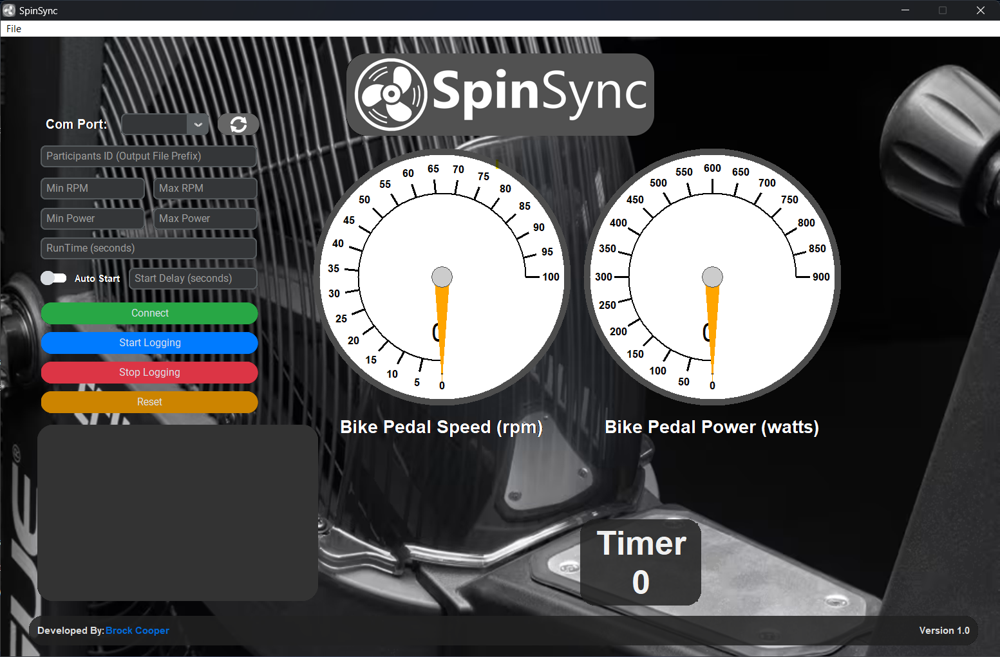

# SpinSync 𖣘
SpinSync is a graphical user interface (GUI) written in python designed for displaying live the power and RPM of a  [Rogue Echo Bike](https://www.rogueaustralia.com.au/rogue-echo-bike-au?gad_source=1).   

The interface has two power and RPM outputs that log to a CSV file. One is raw unfiltered data and the other is a moving average filter that has been applied to smooth the data allowing the gauges to be read easier by the user. The data is logged in 0.5 second intervals.
The data is logged to a CSV file within a folder called '_SpinSync Logs_' located in the `SpinSync.exe` root directory. This folder will be created on the first time the program logs any data.

For more information see the help section on the interface.

There is an `auto_exe_builder.py` file that allows you to compile and build the executable to run on machines that don't have python installed. This uses the pyinstaller python library.

# requirements.txt

- colour==0.1.5
- customtkinter==5.2.2
- darkdetect==0.8.0
- packaging==24.0
- pillow==10.3.0
- pyserial==3.5
- pywinstyles==1.7
- tkdial==0.0.7
- pyinstaller==5.13.2
- CTkMessagebox==2.5
- openpyxl==3.1.2
- odrive==0.6.8